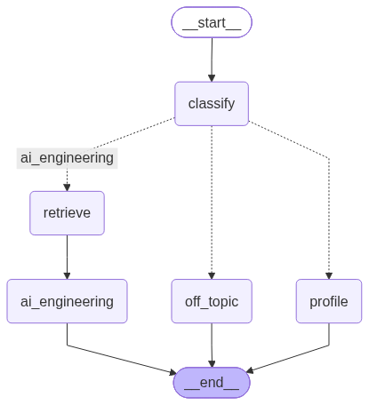

# Agent conversationnel d'entretien

Assistant qui répond aux recruteurs sur le profil de Guillaume Legall, à partir
de son CV et d'ouvrages d'IA engineering indexés dans ChromaDB. Il se souvient
des questions précédentes d'une même conversation. Il s'utilise en ligne de
commande ou dans une interface web.

| Commande | Rôle |
|---|---|
| `uv run cv-assistant ingest` | Indexe les PDF et les EPUB dans ChromaDB |
| `uv run cv-assistant ask "..."` | Répond à une question isolée |
| `uv run cv-assistant chat` | Ouvre une conversation suivie |
| `uv run cv-assistant graph` | Redessine l'image du graphe |
| `uv run streamlit run src/cv_assistant/app.py` | Ouvre l'interface web |

Les tests se lancent sans clé d'API et sans réseau :

```powershell
uv run python -m unittest discover -s tests
```

## Ingest des PDF et des EPUB

Déposez les documents PDF dans `data/pdfs/` et les livres EPUB dans
`data/epubs/` (les sous-dossiers sont également parcourus). Copiez `.env.example`
en `.env` et renseignez-y votre clé d'API OpenAI, puis lancez l'ingest depuis la
racine du projet :

```powershell
Copy-Item .env.example .env
uv run cv-assistant ingest
```

Le fichier `.env` est lu au lancement et n'est pas ajouté à Git. Une variable
`OPENAI_API_KEY` déjà définie dans l'environnement prime sur celle du fichier.

Le texte est extrait page par page pour les PDF et chapitre par chapitre pour
les EPUB, découpé en chunks de 1 000 caractères avec un chevauchement de 150
caractères, puis indexé dans la collection `pdf_documents` de ChromaDB. Chaque
chunk porte en métadonnées son fichier `source` et son numéro de `page` (PDF) ou
de `chapter` (EPUB). Les embeddings sont calculés par l'API d'OpenAI avec le
modèle multilingue `text-embedding-3-small` (vecteurs de 1 536 dimensions), ce
qui permet d'interroger en français des documents en anglais ; le texte des
chunks est donc envoyé à OpenAI, et chaque ingest est facturé au nombre de
tokens.
La base persistante est créée dans `data/chroma/`.

Le modèle est défini dans `embeddings.py`. En changer impose de supprimer
`data/chroma/` puis de relancer l'ingest, car une collection ne peut pas mélanger
des vecteurs de modèles différents.

Options disponibles :

```powershell
uv run cv-assistant ingest --help
uv run cv-assistant ingest --chunk-size 800 --chunk-overlap 100
uv run cv-assistant ingest --pdf-dir documents --epub-dir livres --chroma-dir stockage/chroma
```

Relancer l'ingest met à jour les chunks de chaque document sans dupliquer ses
entrées. Les fichiers PDF, les fichiers EPUB et la base locale ne sont pas
ajoutés à Git.

## Poser une question

L'assistant répond aux recruteurs sur le profil de Guillaume Legall. Il
s'appuie sur deux sources :

- le CV (`data/cv/cv.pdf`), envoyé en entier au modèle à chaque question ;
- les ouvrages d'IA engineering indexés par l'ingest, que Guillaume a lus : ils
  apportent les notions techniques qui ne figurent pas dans le CV.

Déposez le CV dans `data/cv/cv.pdf` (il n'est pas ajouté à Git), lancez l'ingest,
puis posez une question depuis la racine du projet :

```powershell
uv run cv-assistant ask "Guillaume connaît-il le prompt routing ?"
```

Options disponibles :

```powershell
uv run cv-assistant ask --help
uv run cv-assistant ask "Ma question" --top-k 8
uv run cv-assistant ask "Ma question" --cv documents/cv.pdf
uv run cv-assistant ask "Ma question" --chroma-dir stockage/chroma
```

## Mener une conversation

`ask` répond à une question isolée. Pour enchaîner les questions, ouvrez une
conversation : l'assistant se souvient des tours précédents et comprend une
question de suivi comme « Et comment l'évalue-t-on ? ».

```powershell
uv run cv-assistant chat
```

Une ligne vide ou Ctrl+C termine la conversation. `chat` accepte les mêmes
options que `ask`. La conversation vit dans la mémoire du processus : elle est
perdue à sa fermeture. Seuls les 6 derniers tours sont renvoyés au modèle
(`HISTORY_LIMIT` dans `llm.py`).

## Interface web

La même conversation se mène dans le navigateur, avec Streamlit :

```powershell
uv run streamlit run src/cv_assistant/app.py
```

Le volet de gauche reçoit le CV (PDF) et les ouvrages (PDF ou EPUB). Le bouton
« Enregistrer » range le CV dans `data/cv/cv.pdf` et les ouvrages dans
`data/pdfs/` ou `data/epubs/`, puis relance l'ingest si un ouvrage a été ajouté :
tous les ouvrages sont alors réindexés, et l'appel à OpenAI est facturé. La
partie centrale est la conversation avec l'assistant.

Chaque session du navigateur a son propre `thread_id`, donc sa propre mémoire.
Enregistrer un document réassemble le graphe : les conversations en cours
repartent de zéro. Le bouton « Nouvelle conversation » ne remet à zéro que la
vôtre.

Streamlit sert la page sur `http://localhost:8501` ; Ctrl+C dans le terminal
l'arrête. Le fichier `.env` doit se trouver à la racine, comme pour la ligne de
commande.

Le volet de dépôt est pour l'instant visible par tout visiteur, et l'accès à la
page n'est pas encore protégé par mot de passe : à régler avant la mise en
ligne.

## Image Docker

Le `Dockerfile` construit une image qui sert l'interface web sur le port 8501 :

```powershell
docker build -t cv-assistant .
docker run --rm -p 8501:8501 --env-file .env -v "${PWD}/data:/app/data" cv-assistant
```

L'image ne contient ni la clé d'API, ni le CV, ni les ouvrages, ni la base
ChromaDB (`.dockerignore` les écarte). La clé est passée à l'exécution, et le
dossier `data/` est monté sur `/app/data` : sans ce volume, les documents
déposés dans l'interface sont perdus à l'arrêt du conteneur.

## Architecture : le graphe

Le parcours d'une question est un graphe LangGraph, assemblé dans
`rag/graph.py`. C'est le point d'entrée de l'assistant : les commandes `ask` et
`chat` se contentent de l'exécuter.



Le nœud `classify` demande au modèle de classer la question (prompt routing),
d'en détecter la langue et de la reformuler pour qu'elle se comprenne sans la
conversation, puis une arête conditionnelle l'envoie vers la branche de sa
route :

| Route | Questions concernées | Nœuds traversés | Traitement |
|---|---|---|---|
| `profile` | Guillaume, son parcours, un élément de son CV, une salutation | `profile` | Le CV seul est envoyé au modèle |
| `ai_engineering` | Une notion d'IA engineering | `retrieve` puis `ai_engineering` | `retrieve` cherche les 5 chunks d'ouvrages les plus proches, `ai_engineering` les envoie au modèle avec le CV |
| `off_topic` | Tout le reste | `off_topic` | Refus poli, sans appel au modèle de réponse |

L'assistant vouvoie son interlocuteur, parle de Guillaume à la troisième
personne et répond dans la langue détectée par `classify`. Le parcours vient
uniquement du CV ; une notion tirée des ouvrages est présentée comme une
connaissance de Guillaume, sans lui prêter une mise en pratique que le CV ne
montre pas. Les ouvrages ne sont pas cités. Le refus hors sujet est en français,
ou en anglais pour toute autre langue.

Le graphe est compilé avec un checkpointer LangGraph (`InMemorySaver`), qui
conserve l'état de chaque conversation, désignée par son `thread_id`. Le nœud
qui répond ajoute son tour à la clé `history` de l'état ; au tour suivant,
`classify`, `profile` et `ai_engineering` transmettent cet historique au modèle,
et `retrieve` cherche dans les ouvrages avec la question reformulée. Deux
conversations de `thread_id` différents ne partagent rien.

Le package `rag/` est fait de trois couches, chacune ne dépendant que de celle
du dessous : le graphe, les nœuds, puis les services qui parlent à l'extérieur.

| Fichier | Rôle |
|---|---|
| `graph.py` | Assemble le graphe : les nœuds, les arêtes qui les relient et la mémoire des conversations |
| `state.py` | L'état qui circule de nœud en nœud (question, route, langue, question reformulée, extraits, réponse, historique) et les routes |
| `nodes/classify.py` | Nœud `classify` : classe la question, détecte sa langue et la reformule |
| `nodes/profile.py` | Nœud `profile` : répond à partir du CV |
| `nodes/retrieve.py` | Nœud `retrieve` : cherche les extraits d'ouvrages avec la question reformulée |
| `nodes/ai_engineering.py` | Nœud `ai_engineering` : répond à partir du CV et des extraits |
| `nodes/off_topic.py` | Nœud `off_topic` : le message de refus |
| `nodes/persona.py` | Le ton commun aux nœuds `profile` et `ai_engineering` |
| `llm.py` | `Llm` : le seul fichier qui parle au modèle de langage d'OpenAI ; il lui envoie les derniers tours de la conversation avant chaque message |
| `retriever.py` | `Retriever` : le seul fichier du RAG qui interroge la collection ChromaDB |
| `cv.py` | Lit le texte du CV |

Tous les nœuds ont la même forme : le constructeur reçoit ce dont le nœud a
besoin, et l'appel reçoit l'état puis renvoie les clés qu'il y ajoute. Chaque
nœud qui appelle le modèle porte ses propres consignes : pour changer les règles
d'une route, on modifie le fichier de son nœud, sans toucher aux autres.

À côté de `rag/`, `cli.py` contient la ligne de commande, `app.py` l'interface
web, `ingestion/` l'ingest,
et `vector_store.py` ouvre la collection ChromaDB pour l'ingest comme pour la
recherche, avec le modèle d'embedding défini dans `embeddings.py`.

Le classement et la rédaction utilisent le même modèle, `gpt-5.4-nano`
d'OpenAI, dont le nom est défini dans `llm.py`.

Après une modification du graphe, redessinez l'image (le rendu passe par le
service en ligne mermaid.ink) :

```powershell
uv run cv-assistant graph
```
